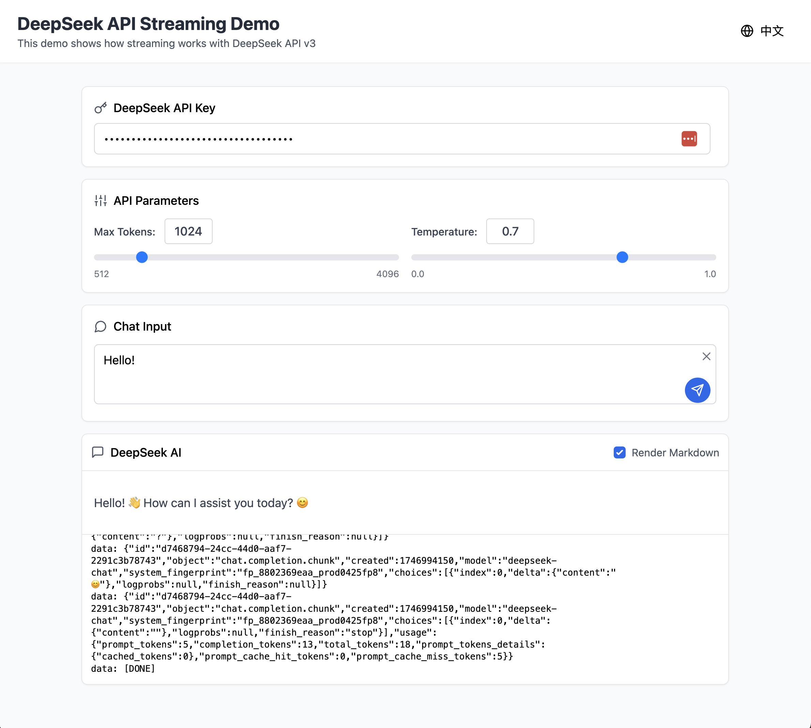

# DeepSeek API 流式传输演示 | DeepSeek API Streaming Demo

## 中文介绍

这是一个展示如何使用 DeepSeek API 进行流式响应的 React 应用程序。该演示应用允许用户与 DeepSeek 大语言模型进行交互，并实时查看 API 的流式响应过程。



### 功能特点

- 🔑 DeepSeek API 密钥管理
- 🔄 实时流式响应显示
- 📊 原始 API 响应数据查看
- 📝 Markdown 渲染支持
- 🌐 中英文双语界面
- 🎛️ 可调节的 API 参数（最大令牌数、温度）
- 📱 响应式设计，适配各种设备

### 技术栈

- **React 18** - 用户界面库
- **TypeScript** - 类型安全的 JavaScript 超集
- **Vite** - 现代前端构建工具
- **Tailwind CSS** - 实用优先的 CSS 框架
- **React Markdown** - Markdown 渲染
- **Lucide React** - 图标库

### 快速开始

#### 前提条件

- Node.js 18+ 和 npm/yarn/pnpm
- DeepSeek API 密钥 (可从 [DeepSeek 官网](https://deepseek.com) 获取)

#### 安装

1. 克隆仓库：

```bash
git clone https://github.com/yourusername/deepseek-streaming-demo.git
cd deepseek-streaming-demo
```

2. 安装依赖：

```bash
npm install
# 或
yarn install
# 或
pnpm install
```

#### 运行开发服务器

```bash
npm run dev
# 或
yarn dev
# 或
pnpm dev
```

应用将在 http://localhost:5173 启动。

### 使用方法

1. 在顶部输入框中输入您的 DeepSeek API 密钥
2. 调整 API 参数（可选）：
   - 最大令牌数：控制响应的最大长度（512-4096）
   - 温度：控制响应的随机性（0-1）
3. 在聊天输入框中输入您的消息
4. 点击发送按钮或按 Enter 键发送消息
5. 观察实时流式响应
6. 可以切换 Markdown 渲染开关来查看原始文本
7. 可以查看底部的原始 API 响应数据

### 构建生产版本

```bash
npm run build
# 或
yarn build
# 或
pnpm build
```

构建后的文件将位于 `dist` 目录中。

## English Introduction

This is a React application that demonstrates how to use the DeepSeek API for streaming responses. The demo app allows users to interact with the DeepSeek large language model and view the API's streaming response process in real-time.

### Features

- 🔑 DeepSeek API key management
- 🔄 Real-time streaming response display
- 📊 Raw API response data viewing
- 📝 Markdown rendering support
- 🌐 Bilingual interface (English/Chinese)
- 🎛️ Adjustable API parameters (max tokens, temperature)
- 📱 Responsive design for various devices

### Tech Stack

- **React 18** - UI library
- **TypeScript** - Type-safe JavaScript superset
- **Vite** - Modern frontend build tool
- **Tailwind CSS** - Utility-first CSS framework
- **React Markdown** - Markdown rendering
- **Lucide React** - Icon library

### Quick Start

#### Prerequisites

- Node.js 18+ and npm/yarn/pnpm
- DeepSeek API key (available from [DeepSeek website](https://deepseek.com))

#### Installation

1. Clone the repository:

```bash
git clone https://github.com/yourusername/deepseek-streaming-demo.git
cd deepseek-streaming-demo
```

2. Install dependencies:

```bash
npm install
# or
yarn install
# or
pnpm install
```

#### Run Development Server

```bash
npm run dev
# or
yarn dev
# or
pnpm dev
```

The application will start at http://localhost:5173.

### Usage

1. Enter your DeepSeek API key in the top input field
2. Adjust API parameters (optional):
   - Max tokens: controls the maximum length of the response (512-4096)
   - Temperature: controls the randomness of the response (0-1)
3. Enter your message in the chat input box
4. Click the send button or press Enter to send the message
5. Observe the real-time streaming response
6. Toggle the Markdown rendering switch to view the raw text
7. View the raw API response data at the bottom

### Build for Production

```bash
npm run build
# or
yarn build
# or
pnpm build
```

The built files will be in the `dist` directory.

## 项目结构 | Project Structure

```
src/
├── components/         # React 组件 | React components
│   ├── ApiKeyInput.tsx     # API 密钥输入组件 | API key input component
│   ├── ApiParameters.tsx   # API 参数调整组件 | API parameters component
│   ├── ChatInput.tsx       # 聊天输入组件 | Chat input component
│   ├── Header.tsx          # 页面头部组件 | Header component
│   ├── Notification.tsx    # 通知提示组件 | Notification component
│   └── ResponseDisplay.tsx # 响应显示组件 | Response display component
├── contexts/           # React 上下文 | React contexts
│   └── LanguageContext.tsx # 语言切换上下文 | Language context
├── services/           # 服务 | Services
│   └── deepseekApi.ts      # DeepSeek API 服务 | DeepSeek API service
├── utils/              # 工具函数 | Utilities
│   └── translations.ts     # 翻译文本 | Translation texts
├── App.tsx             # 主应用组件 | Main app component
├── main.tsx            # 应用入口 | App entry point
└── index.css           # 全局样式 | Global styles
```

## Docker 使用指南 | Docker Usage Guide

### 中文说明

#### 直接从 Docker Hub 运行（无需克隆仓库）

您可以直接从 Docker Hub 拉取并运行此应用，无需克隆代码仓库：

```bash
docker run -p 8080:80 medopaw/aichat-stream-demo
```

应用将在 http://localhost:8080 启动。

#### 从源代码构建并运行

如果您想从源代码构建：

```bash
# 构建并运行 Docker 容器
docker build -t aichat-stream-demo .
docker run -p 8080:80 aichat-stream-demo
```

应用将在 http://localhost:8080 启动。

#### 使用 Docker Compose 运行

如果您安装了 Docker Compose，可以更简单地运行：

```bash
docker-compose up -d
```

应用同样将在 http://localhost:8080 启动。

### English Instructions

#### Run directly from Docker Hub (no need to clone repository)

You can pull and run this application directly from Docker Hub without cloning the code repository:

```bash
docker run -p 8080:80 medopaw/aichat-stream-demo
```

The application will be available at http://localhost:8080.

#### Build and run from source code

If you want to build from source:

```bash
# Build and run Docker container
docker build -t aichat-stream-demo .
docker run -p 8080:80 aichat-stream-demo
```

The application will be available at http://localhost:8080.

#### Run with Docker Compose

If you have Docker Compose installed, you can run it even more easily:

```bash
docker-compose up -d
```

The application will also be available at http://localhost:8080.

## 许可证 | License

MIT

## 致谢 | Acknowledgements

- [DeepSeek](https://deepseek.com) - 提供 API 服务 | Providing API service
- [React](https://reactjs.org/) - 用户界面库 | UI library
- [Tailwind CSS](https://tailwindcss.com/) - CSS 框架 | CSS framework
- [Vite](https://vitejs.dev/) - 构建工具 | Build tool
- [Docker](https://www.docker.com/) - 容器化平台 | Containerization platform
- [Nginx](https://nginx.org/) - Web服务器 | Web server
